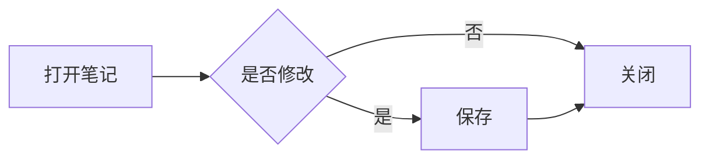
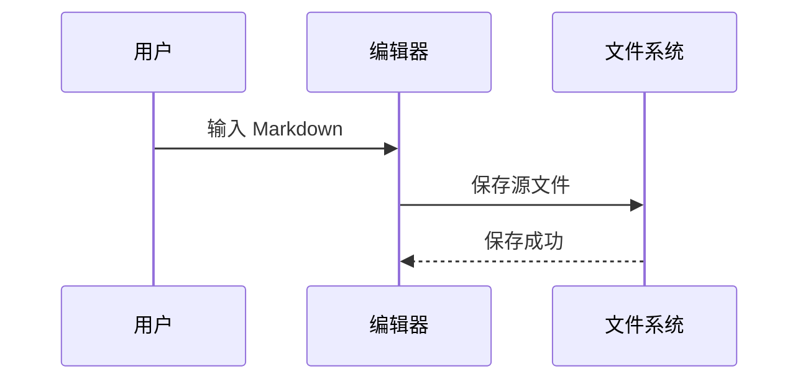

# Markdown 语法完整性测试

> 用途：检查 Synapse 对 CommonMark、GFM 以及常见扩展语法的编辑、实时呈现、光标定位和保存能力。

## 1. 标题

# 一级标题
## 二级标题
### 三级标题
#### 四级标题
##### 五级标题
###### 六级标题

替代形式一级标题
================

替代形式二级标题
----------------

## 2. 普通段落与换行

这是一段普通中文。This is an English sentence. 数字：1234567890，符号：`~!@#$%^&*()_+-={}[]|\:;"'<>,.?/`。

这是同一段中的第一行，行尾没有空格，下一行通常仍属于同一个段落。
这是同一段中的第二行。

这一行末尾有两个空格，应该产生硬换行。  
这里应该从新行开始。

这一行使用反斜杠产生硬换行。\
这里也应该从新行开始。

## 3. 文本样式

- *星号斜体*
- _下划线斜体_
- **星号粗体**
- __下划线粗体__
- ***粗斜体***
- ___另一种粗斜体___
- ~~删除线（GFM）~~
- `行内代码`
- **粗体中包含 _斜体_ 和 `代码`**
- 普通文字<mark>高亮 HTML</mark>
- H<sub>2</sub>O 与 x<sup>2</sup>
- <u>下划线 HTML</u>

样式边界：前缀**粗体**后缀，前缀*斜体*后缀，中文「**强调内容**」测试。

## 4. 转义字符

以下字符应显示为字面量而不是语法：

\*不是斜体\*
\# 不是标题
\- 不是列表
\[不是链接\]\(https://example.com\)
反斜杠：\\

## 5. 无序列表

- 第一项
- 第二项
  - 二级项目 A
  - 二级项目 B
    - 三级项目
- 第三项

* 星号项目
* 星号项目

+ 加号项目
+ 加号项目

- 包含多段内容的列表项

  这是同一列表项的第二个段落。

  > 这是列表项内的引用。

  ```text
  这是列表项内的代码块。
  ```

## 6. 有序列表

1. 第一项
2. 第二项
   1. 二级第一项
   2. 二级第二项
      1. 三级第一项
3. 第三项

1) 圆括号风格第一项（扩展语法）
2) 圆括号风格第二项

8. 从 8 开始
9. 下一项应为 9

## 7. 混合列表与任务列表

1. 规划
   - [x] 已完成任务
   - [ ] 未完成任务
   - [X] 大写 X 的完成任务
2. 开发
   - 编辑器
     1. 输入
     2. 呈现
   - 文件管理
3. 验收

## 8. 引用

> 一级引用
>
> 引用中的第二个段落。
>
> > 二级嵌套引用
> >
> > - 引用中的列表
> > - 第二项
>
> 回到一级引用。

> [!NOTE]
> Obsidian 风格提示块：Note。

> [!WARNING] 自定义标题
> Obsidian 风格提示块：Warning。

## 9. 分隔线

---

***

___

## 10. 链接与自动链接

- [普通链接](https://commonmark.org/)
- [带标题的链接](https://github.com/ "GitHub")
- [相对文档链接](./Task.md)
- [页内标题链接](#11-图片)
- <https://www.rust-lang.org/>
- <test@example.com>
- GFM 自动链接：https://example.com/path?q=markdown
- [引用式链接][commonmark]
- [简写引用链接]

[commonmark]: https://spec.commonmark.org/ "CommonMark Specification"
[简写引用链接]: https://github.github.com/gfm/

## 11. 图片


[](https://example.com/)

## 12. 行内代码

使用 `cargo test --workspace` 运行测试。

使用双反引号包裹包含反引号的内容：``const value = `nested`;``。

行内代码保留空格：`  leading and trailing  `。

## 13. 围栏代码块

```rust
fn main() {
    let message = "你好，Synapse 👋";
    println!("{message}");
}
```

```javascript
const items = ["Markdown", "GPUI", "Writ"];
console.log(items.map((item) => `- ${item}`).join("\n"));
```

```json
{
  "name": "Synapse",
  "unicode": "中文与 emoji 🚀",
  "enabled": true,
  "count": 3
}
```

```diff
- 删除的内容
+ 新增的内容
  保持不变的内容
```

~~~python
def greet(name: str) -> str:
    return f"Hello, {name}!"
~~~

四个空格缩进的代码块：

    fn indented() {
        println!("indented code block");
    }

## 14. 表格（GFM）

| 左对齐 | 居中对齐 | 右对齐 |
| :--- | :---: | ---: |
| 普通文本 | **粗体** | 123.45 |
| 中文 | `code` | -8 |
| 包含竖线 | `a \| b` | [链接](https://example.com/) |

| 最小 | 表格 |
| --- | --- |
| A | B |

## 15. 脚注（扩展语法）

这句话包含一个脚注。[^1] 这里还有一个命名脚注。[^note]

[^1]: 这是第一个脚注的内容。
[^note]: 这是命名脚注。

    脚注可以包含缩进后的第二个段落。

## 16. 定义列表（扩展语法）

Markdown
: 一种轻量级标记语言。

GPUI
: 用于构建桌面界面的 Rust 框架。
: 同一个术语可以有第二条定义。

## 17. 数学公式（扩展语法）

行内公式：$E = mc^2$，勾股定理：$a^2 + b^2 = c^2$。

$$
\int_{-\infty}^{\infty} e^{-x^2}\,dx = \sqrt{\pi}
$$

$$
\begin{aligned}
f(x) &= x^2 + 2x + 1 \\
     &= (x + 1)^2
\end{aligned}
$$

## 18. Mermaid（扩展语法）





## 19. HTML

<details>
<summary>点击展开详情</summary>

这里是折叠区域中的 **Markdown** 内容。

</details>

<kbd>⌘</kbd> + <kbd>S</kbd> 保存文档。

<table>
  <thead>
    <tr><th>HTML 表头</th><th>值</th></tr>
  </thead>
  <tbody>
    <tr><td>第一行</td><td>1</td></tr>
    <tr><td>第二行</td><td>2</td></tr>
  </tbody>
</table>

<!-- 这是一条 HTML 注释，预览时通常不可见。 -->

## 20. Emoji 与 Unicode

- Emoji：😀 😅 🚀 ❤️ 👍🏽 👨‍👩‍👧‍👦 🏳️‍🌈
- 中文：你好，世界！
- 日文：こんにちは世界
- 韩文：안녕하세요 세계
- 阿拉伯文：مرحبا بالعالم
- 组合字符：é（e + combining acute）
- 数学字符：α β γ ∑ ∞ ≠ ≤ ≥
- 全角标点：，。！？【】「」《》

## 21. 特殊解析边界

URL 与标点：https://example.com/test。

连续强调：***粗斜体***紧邻普通文本。

下划线在单词中：snake_case_should_not_be_emphasis。

邮箱：editor+markdown@example.com。

数字小数：3.1415926，不应被识别为有序列表。

2026. 这一行是否被识别为列表，取决于解析规则。

`# 代码中的标题` 不应该变成标题。

`` `代码中的反引号` ``

## 22. 长文本与软换行

这是一行刻意写得非常长的文本，用来检查编辑器是否会在可见编辑区域内正确进行软换行，而不是让文本无限向右延伸并被右侧区域裁切。The same line also contains English words, a long identifier such as `synapse_markdown_editor_soft_wrap_validation_identifier`, numbers 0123456789, and emoji 🚀🚀🚀 so that cursor movement, glyph shaping, horizontal boundaries, and source-to-display position mapping can all be observed without introducing a hard line break.

## 23. 连续空行与空白

上方普通段落。


中间存在三个空行。

- 列表项之后存在空白


- 下一列表项

## 24. 编辑行为手动测试区

请在下面逐项进行手动编辑：

- [ ] 在此处输入中文并观察输入法候选窗
- [ ] 在此处粘贴单行中文
- [ ] 在此处粘贴多行 Markdown
- [ ] 从系统剪贴板粘贴一张图片，检查同级 `assets/` 生成原格式附件并自动插入相对图片语法
- [ ] 用鼠标点击行首、行中和行尾定位光标
- [ ] 使用方向键跨越中文、emoji 和短行
- [ ] 在下一行无序列表末尾按 Enter，检查是否自动续写
- [ ] 在下一行有序列表末尾按 Enter，检查序号是否递增
- [ ] 清空列表项后按 Enter，检查是否退出列表
- [ ] 修改内容后保存、关闭并重新打开，检查源码是否保持一致

- 无序列表续写测试

1. 有序列表续写测试

- [ ] 任务列表续写测试

> 引用续写测试

## 25. 期望检查结果

1. Markdown 源码可以完整输入、粘贴、选择、删除和保存。
2. 中文、emoji 与组合字符不会造成光标错位或文本损坏。
3. 长行在编辑器宽度内软换行，不被右侧裁切。
4. 语法呈现不会改变磁盘中的 Markdown 源码。
5. 光标所在位置显示必要的源码标记，离开后恢复阅读样式。
6. 不支持的扩展语法至少应以完整源码安全显示，不能丢失内容。
7. 远程图片可以经过 HTTPS/重定向加载；粘贴图片不会覆盖 `assets/` 中已有的同名附件。
